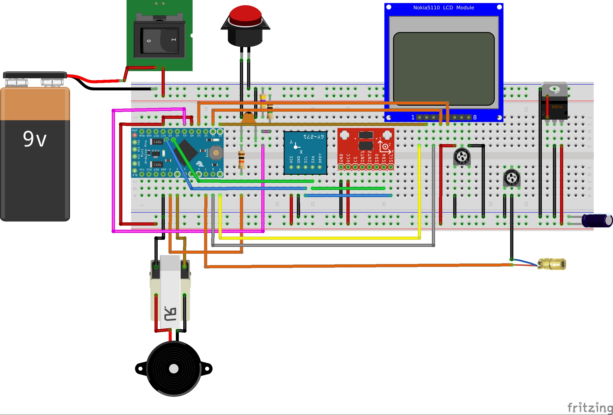

# Tanduino

Tanduino is an Arduino based project aimed to mimic the analog "tandem" inclinometer + compass.

## User guide

* Power the device with a DC 3.3V to 9V battery.
* Turn on and off the device with the side on off switch.
* Push the temporary button to hold unhold the readings.
* The laser diode is on when unhold, never look at it directly in the eye.
* Rotated the trimmer resistor with a screwdriver to adjust the backlight level.

## Ratings

* Heading precision: 0.1º
* Pitch precision: 0.1º
* Power consumption*:
  - hold state: 53mW
  - unhold state: 60mW
* Laser maximum distance: ?m

*Measured with lowest backlight level at 20ºC.

## Developer guide

### Software design

...

#### Dependencies

* [Adafruit Sensor library](https://github.com/adafruit/Adafruit_Sensor "Adafruit Sensor library")
* [Adafruit ADXL345 library](https://github.com/adafruit/Adafruit_ADXL345 "Adafruit ADXL345 library")
* [Adafruit HMC5883 Unified library](https://github.com/adafruit/Adafruit_HMC5883_Unified "Adafruit HMC5883 Unified library")
* [Adafruit GFX library](https://github.com/adafruit/Adafruit-GFX-Library "Adafruit GFX library")
* [Adafruit PCD8544 Nokia 5110 LCD library](https://github.com/adafruit/Adafruit-PCD8544-Nokia-5110-LCD-library "Adafruit PCD8544 Nokia 5110 LCD library")

### Electronic design

#### Hardware list

* Arduino Pro Mini ATmega328 8MHz 3.3V
* Triple Axis Digital Compass HMC5883L
* Triple Axis Accelerometer ADXL345
* 84*48 LCD Display PCD8544
* 5mW 650nm 3V red laser diode
* Rocker on/off button
* Temporary push button
* 10kΩ resistor and 100nF ceramic capacitor for push button debouncing
* 470kΩ and 1MΩ resistors to divide battery voltage sensing
* 10kΩ trimmer resistor to adjust display's backlight
* LT1521 3.3V 300mA voltage regulator and 1µF electrolitic capacitor
